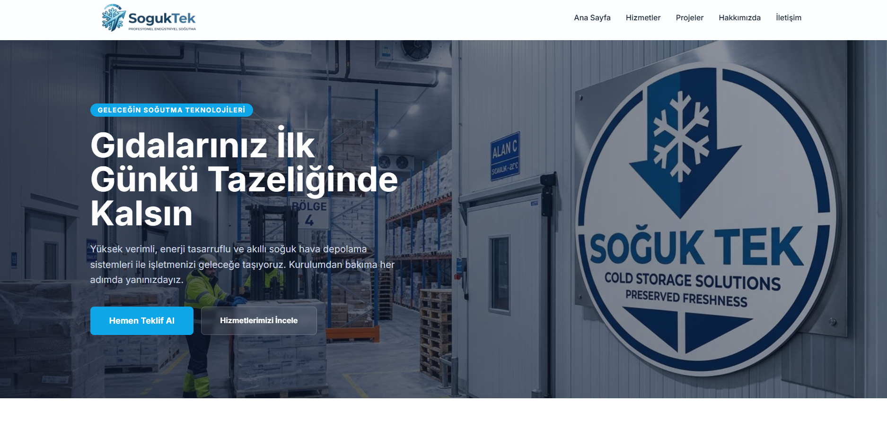
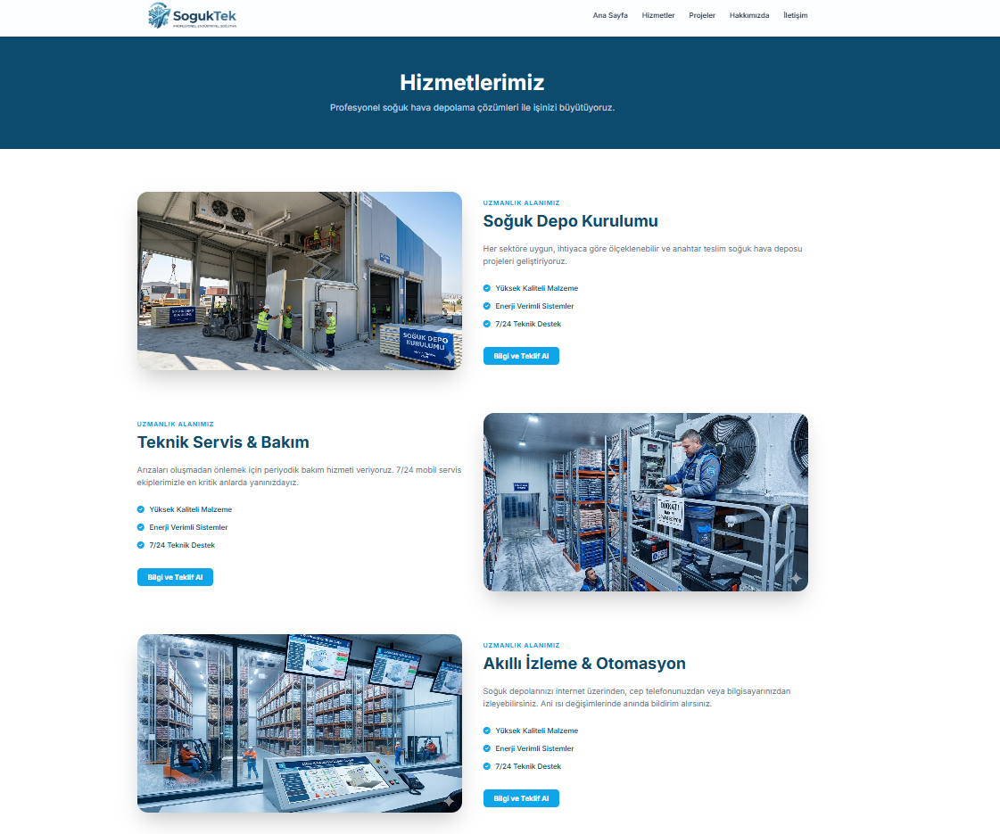

Demo Website : https://sogukhavasitesi.onrender.com/
# SoğukTek Soğutma Sistemleri - Kurumsal Web Sitesi & Yönetim Paneli

Bu proje, endüstriyel soğutma sistemleri üzerine hizmet veren bir firma için geliştirilmiş, dinamik içerik yönetimine sahip modern bir kurumsal web sitesidir.

## 📸 Ekran Görüntüleri

| Ana Sayfa | Yönetim Paneli |
| :---: | :---: |
|  |  |


## 🚀 Özellikler

- **Modern & Responsive Tasarım**: Tailwind CSS ile geliştirilmiş, tüm cihazlara (mobil, tablet, desktop) tam uyumlu arayüz.
- **Gelişmiş Yönetim Paneli**:
  - **İçerik Yönetimi**: Ana sayfa banner (Hero), istatistikler, referanslar ve SEO ayarlarını anlık güncelleme.
  - **Hizmet Yönetimi**: Hizmet ekleme, silme, düzenleme ve özellik listesi oluşturma.
  - **Proje Portfolyosu**: Tamamlanan projeleri kategori ve görselleriyle birlikte yönetme.
  - **Hakkımızda Sayfası**: Vizyon, misyon ve kurumsal bilgileri düzenleme.
- **Dinamik Veri Altyapısı**: Veritabanı kurulumu gerektirmeyen, JSON tabanlı hızlı veri saklama sistemi.
- **Dosya Yükleme Sistemi**: Tüm görselleri (Logo, Banner, Proje Resimleri) bilgisayardan seçerek yükleme (Multer entegrasyonu).
- **İletişim Formu**:
  - Telefon numarası doğrulamalı form yapısı.
  - Gelen mesajları admin panelinden okuma ve silme.
  - SMTP üzerinden e-posta bildirim desteği.
- **Güvenlik**: Şifre korumalı admin girişi ve profil (kullanıcı adı/şifre) güncelleme imkanı.

## 🛠️ Teknolojiler

- **Backend**: Node.js, Express.js
- **Frontend**: EJS (Embedded JavaScript Templates), Tailwind CSS
- **Dosya Yönetimi**: Multer
- **E-posta**: Nodemailer
- **Veri Saklama**: JSON (Local File System)

## 📦 Kurulum

Projeyi yerel bilgisayarınızda çalıştırmak için şu adımları izleyin:

1. Depoyu klonlayın:
   ```bash
   git clone https://github.com/kullaniciadi/proje-adi.git
   ```
2. Proje dizinine gidin:
   ```bash
   cd proje-adi
   ```
3. Gerekli paketleri yükleyin:
   ```bash
   npm install
   ```
4. Uygulamayı başlatın:
   ```bash
   npm start
   ```
5. Tarayıcınızda açın: `http://localhost:3000`
Demo Website : https://sogukhavasitesi.onrender.com/
## 🔐 Admin Paneli Bilgileri

Varsayılan giriş bilgileri:
- **URL**: `http://localhost:3000/admin`
- **Kullanıcı Adı**: `admin`
- **Şifre**: `admin`

*(Not: Giriş yaptıktan sonra Admin Profili sayfasından bilgilerinizi değiştirmeniz önerilir.)*

## 📁 Dosya Yapısı

- `/data/content.json`: Tüm dinamik içeriklerin ve mesajların saklandığı dosya.
- `/public/uploads/`: Yüklenen resimlerin depolandığı klasör.
- `/views/`: EJS şablon dosyaları.
- `/views/admin/`: Yönetim paneli sayfaları.
- `app.js`: Uygulamanın ana giriş ve konfigürasyon dosyası.

## 📄 Lisans

Bu proje [MIT](LICENSE) lisansı altında lisanslanmıştır. Daha fazla bilgi için `LICENSE` dosyasına bakınız.

---
© 2026 SoğukTek Systems. Tüm hakları saklıdır.
